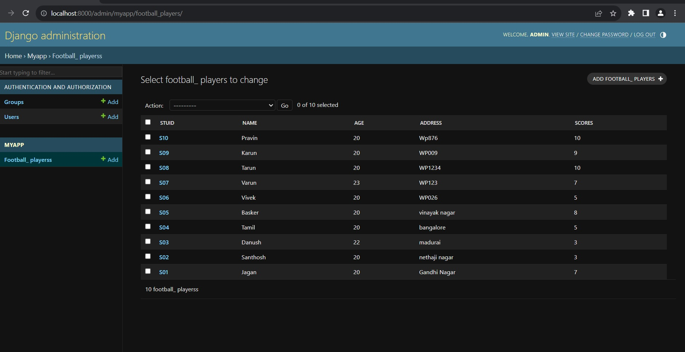

# Ex02 Django ORM Web Application
## Date: 18.10.2023

## AIM
To develop a Django application to store and retrieve data from a Football Players database using Object Relational Mapping(ORM).


## DESIGN STEPS

### STEP 1:
Clone the problem from GitHub

### STEP 2:
Create a new app in Django project

### STEP 3:
Enter the code for admin.py and models.py

### STEP 4:
Execute Django admin and create 10 Football players

## PROGRAM
```
admin.py
from django.contrib import admin
from .models import Football_Players,Football_PlayersAdmin
admin.site.register(Football_Players,Football_PlayersAdmin)
models.py
from django.db import models
from django.contrib import admin
class Football_Players(models.Model):
    stuid=models.CharField(max_length=20)
    name=models.CharField(max_length=20)
    age=models.IntegerField()
    address=models.CharField(max_length=50)
    scores=models.IntegerField()
class Football_PlayersAdmin(admin.ModelAdmin):
    list_display=('stuid','name','age','address','scores')
# Create your models here.

```


## OUTPUT



## RESULT
Thus the program for creating a database using ORM hass been executed successfully
